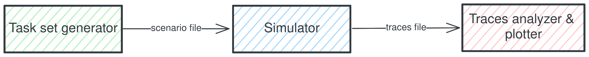

# Schedsim

A suite of simulation tools for testing scheduling policies.

## Principle



The project is divided in 4 projects:
  - A taskset and platform generator, `schegen`,
  - A scheduling simulator, `schedsim`,
  - A logs analyzer and GANTT plotter, `schedview`,
  - A library helping to share data between those softwares, `protocols`. 

Each projects are store in there own directory.

## Building

The project depends on tools and libraries that must be installed before the project can be built :
  - [CMake](https://cmake.org/)
  - [Doxygen](https://www.doxygen.nl/)
  - [Graphviz](https://graphviz.org/)

The rest of the dependencies are store in the `external` directory and are managed by CMake.

Build all projects with CMake, like this:
```bash
  cmake -S . -B build -G Ninja
  cmake --build build
```

Or a specific one:
```bash
  cmake -S . -B build -G Ninja
  cmake --build build -t schedgen
  cmake --build build -t schedsim
  cmake --build build -t schedview
```

## Documentation

Build the documentation localy as follows:

```bash
  cmake -S . -B build -G Ninja
  cmake --build build -t doxygen
```

And open the generated index located at `/doc/html/index.html`


## Usage/Examples

To simulate a scenario, give a scenario file in YAML as an argument to the simulator:

```bash
  ./build/schedsim/schedsim tests/scenarios/multi-ex4.json
```
