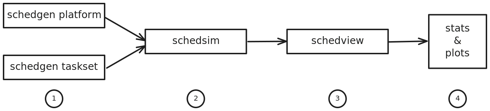

# Schedsim

A suite of three tools for simulating the execution of multicore schedulers.

## Installation

To compile the software, you can use [Nix](https://nixos.org) :

```
nix build
```
Then run the programs:
```
$ result/bin/schedgen
$ result/bin/schedsim
$ result/bin/schedview
```
To compile the software using `cmake`:

```
cmake -S . -B build -G Ninja -DCMAKE_BUILD_TYPE=Release
```

```
cmake --build build
```

Then run the programs :
```
$ build/schedgen/schedgen
$ build/schedsim/schedsim
$ build/schedview/schedview
```

## Usage

<picture>
  <source media="(prefers-color-scheme: dark)" srcset="doc/background-dark.svg">
  <source media="(prefers-color-scheme: light)" srcset="doc/background.svg">
  
</picture>

1. Use `schedgen` to generate new task sets with your parameters. Here, we
   generate a scenario of 10 tasks with a total utilization of 3.9, a success
   rate of 10%, a 10% compression ratio for the WCET, and tasks with a maximum
   utilization of 1.

   ```
   ./build/schedgen/schedgen taskset -t 10 -u 3.9 -s 0.1 -c 0.1 --umax 1 -o scenario.json
   ```

2. Then, use `schedsim` to simulate the execution of your task set and specify a platform for it to run on.

   > [!TIP]
   > You can use the platforms provided in the `platforms/` folder.

   In the following example, we use the LITTLE cluster of the exynos5422 (composed of four cores) to run the previously generated task set, and we schedule it with GRUB.

   ```
   ./build/schedsim/schedsim -p platforms/exynos5422LITTLE.json --sched grub -s scenario.json
   ```

3. Finally, use `schedview` to analyze the execution traces (in JSON) or generate graphs.
   Here you can display all the events of the simulation performed in the previous state.
   ```
   ./build/schedview/schedview logs.json -p platforms/exynos5422LITTLE.json
   ```
   ```
   [135.92326] (         )                 resched:
   [135.92326] (         )     virtual_time_update: tid = 1, virtual_time = 1028.9
   [135.92326] (         )     virtual_time_update: tid = 8, virtual_time = 2549.3
   [135.92326] (         )     virtual_time_update: tid = 2, virtual_time = 2565.2
   [135.92326] (         ) serv_budget_replenished: tid = 1, budget = 529.88
   [135.92326] (         ) serv_budget_replenished: tid = 8, budget = 88.013
   [135.92326] (         )              proc_idled: cpu = 3
   [135.92326] (         ) serv_budget_replenished: tid = 2, budget = 12.443
   [148.36663] (+12.44337)   serv_budget_exhausted: tid = 2
   [148.36663] (         )     virtual_time_update: tid = 2, virtual_time = 2800
   [148.36663] (         )           serv_postpone: tid = 2, deadline = 5600
   [148.36663] (         )                 resched:
   [148.36663] (         )     virtual_time_update: tid = 1, virtual_time = 1123.1
   [148.36663] (         )     virtual_time_update: tid = 8, virtual_time = 2782.7
   [148.36663] (         )     virtual_time_update: tid = 2, virtual_time = 2800
   [148.36663] (         )            serv_running: tid = 6
   [148.36663] (         )          task_scheduled: tid = 6, cpu = 3

   ```

In the following sections you'll find the options available for each command.


### Schedgen

Task set generator for mono-core and multi-core systems.

Usage: `schedgen taskset [OPTION...]`
  - `-h, --help`             Show this help message.
  - `-t, --tasks arg`        Specify the number of tasks to generate.
  - `-u, --totalu arg`       Set the total utilization of the task set.
  - `-m, --umax arg`         Define the maximum utilization for a task (range: 0 to 1).
  - `-s, --success arg`      Specify the success rate of deadlines met (range: 0 to 1).
  - `-c, --compression arg`  Set the compression ratio for the tasks (range: 0 to 1).
  - `-o, --output arg`       Output file to write the generated scenario.

Platform configuration file generator.

Usage: `schedgen platform [OPTION...]`
  - `-h, --help`        Show this help message.
  - `-c, --cores arg`   Specify the number of processor cores.
  - `-f, --freq arg`    Define the allowed operating frequencies.
  - `-e, --eff arg`     Add an effective frequency (actual frequency that minimize the total energy consumption).
  - `-p, --power arg`   Set the power model for the platform.
  - `-o, --output arg`  Specify the output file to write the configuration.


### Schedsim

GRUB scheduler simulation for a given task set and platform.

Usage: `schedsim [OPTION...]`
  - `-h, --help`          Show this help message.
  - `-s, --scenario arg`  Specify the scenario file.
  - `-p, --platform arg`  Specify the platform configuration file.
  - `    --sched arg`     Specify the scheduling policy to be used.
  - `    --scheds`        List the available schedulers.
  - `-o, --output arg`    Specify the output file to write the simulation results.


### Schedview

Simulation trace analysis and plot generation tool (for post-simulation analysis of schedsim).

Usage: `schedview [OPTION...] infile`
  - `-h, --help`              Show this help message.
  - `-p, --print`             Print the trace logs.
  - `-d, --directory arg`     Analyze all simulation traces within a directory.
  - `-i, --index`             Add column names to table data.
  - `-f, --frequency`         Print frequency change events.
  - `-m, --cores`             Print active core count changes.
  - `-r, --rtsched`           Generate an RTSched LaTeX file.
  - `    --procmode`          Generate RTSched LaTeX file with processor mode.
  - `-s, --svg`               Generate a GANTT chart in SVG format.
  - `    --html`              Generate a GANTT chart in HTML format.
  - `    --au`                Print active utilization metrics.
  - `-e, --energy`            Print the energy used by the platform during the simulation.
  - `    --duration`          Print task set execution duration.
  - `    --preemptions`       Print the number of preemptions.
  - `    --contextswitch`     Print the number of context switches.
  - `    --rejected`          Print the number of tasks rejected by the admission test.
  - `    --dpm-request`       Print the number of requests to change core C-state.
  - `    --freq-request`      Print the number of requests to change frequency.
  - `    --deadlines-rates`   Print the rate of missed deadlines.
  - `    --deadlines-counts`  Print the count of missed deadlines.
  - `    --platform arg`      Specify the hardware description file (default: platform.json).
