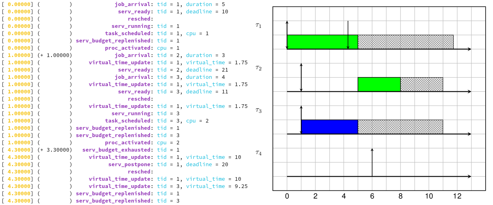

# Trace viewer

Convert simulation traces to a readeable textual logs or a RTSched GANTT diagram ready to be compiled with LaTeX.


## Screenshot




## Build & use

Build the software with CMake :

```bash
cmake -S . -B build -G Ninja
cmake --build build -t viewer
```

And use it with the trace you want to open :
```bash
./build/viewer/viewer trace.json
```
